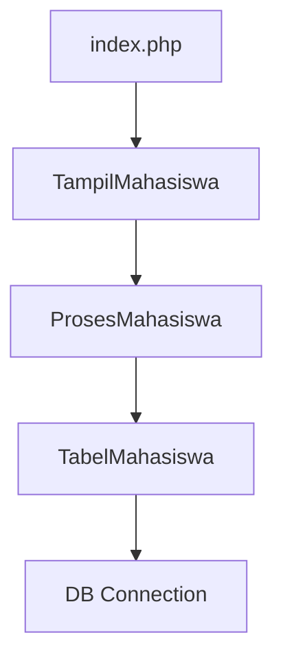

# Sistem Manajemen Data Mahasiswa

## Janji
Saya Safira Aliyah Azmi dengan NIM 2309209 mengerjakan Tugas Praktikum 9 dalam mata kuliah Desain dan Pemrograman Berorientasi Objek untuk keberkahanNya maka saya tidak melakukan kecurangan seperti yang telah dispesifikasikan. Aamiin.

## Desain Program

### Arsitektur MVP (Model-View-Presenter)

Aplikasi ini menggunakan pola desain MVP yang memisahkan logika aplikasi menjadi tiga komponen utama:

```
┌─────────────────────────────────────────────────────────────────┐
│                    ARSITEKTUR MVP                               │
├─────────────────────────────────────────────────────────────────┤
│                                                                 │
│   ┌─────────┐    <communicates>    ┌─────────────┐              │
│   │  VIEW   │ ◄──────────────────► │  PRESENTER  │              │
│   └─────────┘                     └─────────────┘               │
│       ▲                                  ▲                      │
│       │                                  │                      │
│       │   <displays>          <updates>  │                      │
│       │                                  │                      │
│       ▼                                  ▼                      │
│   ┌─────────────────────────────────────────────┐               │
│   │               MODEL                         │               │
│   └─────────────────────────────────────────────┘               │
│                                                                 │
└─────────────────────────────────────────────────────────────────┘
```

### Komponen Utama

#### 1. Model

* **DB.class.php** : Class untuk mengelola koneksi database
* **Mahasiswa.class.php** : Class entitas untuk merepresentasikan data mahasiswa
* **TabelMahasiswa.class.php** : Class untuk operasi CRUD (Create, Read, Update, Delete)

#### 2. View

* **TampilMahasiswa.php** : Class untuk mengelola tampilan aplikasi
* **Templates** : File HTML untuk UI (skin.html, form-edit-update.html)

#### 3. Presenter

* **ProsesMahasiswa.php** : Class yang menjembatani Model dan View
* **KontrakPresenter.php** : Interface yang mendefinisikan method presenter

## Struktur Direktori

```
program/
├── model/
│   ├── DB.class.php
│   ├── Mahasiswa.class.php
│   └── TabelMahasiswa.class.php
├── presenter/
│   ├── KontrakPresenter.php
│   └── ProsesMahasiswa.php
├── templates/
│   ├── skin.html
│   └── form-edit-update.html
├── view/
│   ├── KontrakView.php
│   └── TampilMahasiswa.php
└── index.php
```

## Alur Kerja Aplikasi

### 1. Inisialisasi



### 2. Alur CRUD Operations

#### Create (Tambah Data)

1. User mengklik tombol "Tambah Mahasiswa"
2. View menampilkan form tambah (form-edit-update.html)
3. User mengisi form dan submit
4. Data dikirim ke Presenter (ProsesMahasiswa)
5. Presenter memvalidasi dan meneruskan ke Model (TabelMahasiswa)
6. Model menyimpan data ke database
7. View menampilkan hasil operasi

#### Read (Tampil Data)

1. User mengakses halaman utama
2. View memanggil Presenter untuk mengambil data
3. Presenter menggunakan Model untuk query database
4. Model mengembalikan data mahasiswa
5. Presenter memproses data dan mengirim ke View
6. View menampilkan tabel mahasiswa

#### Update (Edit Data)

1. User mengklik tombol "Edit" pada data tertentu
2. View menampilkan form edit dengan data yang sudah diisi
3. User mengubah data dan submit
4. Data dikirim ke Presenter
5. Presenter memvalidasi dan meneruskan ke Model
6. Model mengupdate data di database
7. View menampilkan hasil operasi

#### Delete (Hapus Data)

1. User mengklik tombol "Hapus" pada data tertentu
2. Muncul konfirmasi JavaScript
3. Jika dikonfirmasi, request dikirim ke Presenter
4. Presenter meneruskan ke Model untuk hapus data
5. Model menghapus data dari database
6. View menampilkan hasil operasi

## Fitur Utama

1. **Manajemen Data Mahasiswa**

   * Tambah data mahasiswa baru
   * Edit data mahasiswa yang sudah ada
   * Hapus data mahasiswa
   * Tampilkan daftar semua mahasiswa
2. **Field Data**

   * NIM (Nomor Induk Mahasiswa)
   * Nama
   * Tempat Lahir
   * Tanggal Lahir
   * Gender (Laki-laki/Perempuan)
   * Email
   * Telepon
